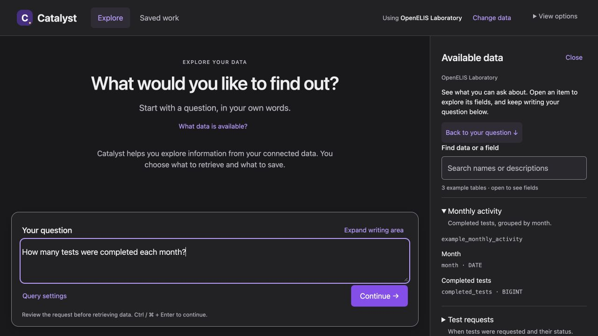
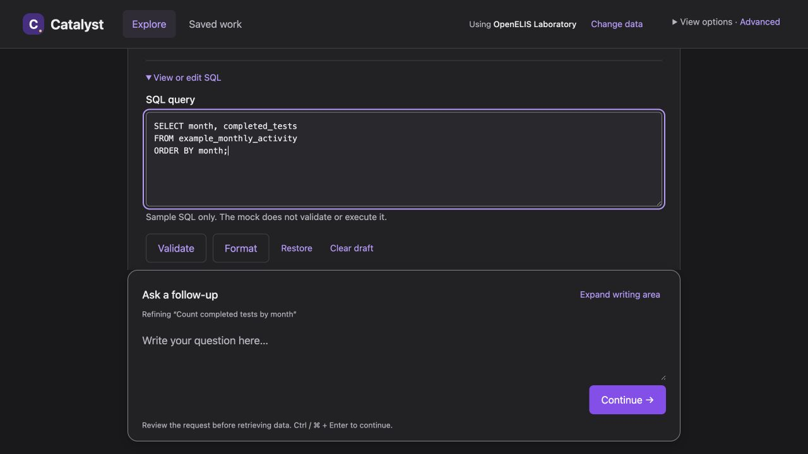

# Research and QA record

Reviewed 9 September 2026. This is a design proposal and expert review, not a
usability study with clinical staff and not implementation acceptance.

## Evidence boundaries

The [overlap table](overlap.md) separates existing requirements, implementation
evidence, and proposed changes. It includes pinned Catalyst and harness sources.

- **Live app observations:** earlier in this review, existing OpenELIS and
  OpenMRS HIV verification sessions were inspected in the local Catalyst app at
  revision `c0e11c733927331d9380256f60188416ed41edf8`, at 1280 × 720. No model request,
  database execution, Dataset save, or publication was made for that inspection.
- **Current source comparison:** this PR starts from Catalyst `main` at
  `4c6a46fa121ea7ce6dff7784547e2eb6aa236fa6`. Relevant UI code was rechecked for the
  overlap table. Source inspection does not prove that revision is deployed.
- **Mock checks below:** run against this directory's fictional, in-memory
  preview. Source selection, query preparation, saves, and publication buttons
  only change illustrative state. They make no application-service requests.

## Observed product friction

Both sources had a fixed 72 px follow-up field with resizing disabled. An
eight-line question needed 216 px of content height. Initial and follow-up
questions use different component implementations. The landing screen displayed
30 technical OpenELIS relation cards; the design already calls for a compact
complete-data browser. OpenMRS exposed `configured_limit` without explaining that
more rows existed and the total was unknown. Dataset review placed internal
metadata above results. Escape closed that panel but returned focus to BODY in
two observations, despite existing focus-restoration code.

The analyst editor and empty libraries were inspected. Populated Widget
arrangement, live publication/import, mobile behavior and all conversation
outcomes were **not** validated in that live-app review. The earlier viewport
override retained 1280 × 720; narrow mock checks below are a separate result.

## Research applied

Sources were checked on 9 September 2026. The proposal combines current component
guidance with established usability principles; it does not require a new
framework or claim that longstanding guidance is newly invented.

| Source | Finding used in the design |
| --- | --- |
| [Carbon: Text input and TextArea](https://carbondesignsystem.com/components/text-input/usage/) | Longer input needs a persistent label and adequate space; use the existing TextArea with vertical resizing. |
| [Nielsen Norman Group: Progressive disclosure](https://www.nngroup.com/articles/progressive-disclosure/) | Put frequent tasks first and keep secondary controls discoverable. Apply to SQL, schema, model configuration and traces without hiding errors or removing access. |
| [Carbon for AI](https://carbondesignsystem.com/guidelines/carbon-for-ai/) and [AI label](https://carbondesignsystem.com/components/ai-label/usage/) | Identify AI-prepared content in context and expose its actual details. Do not label a person's input as AI-generated. |
| [Nielsen Norman Group: Explainable AI in Chat Interfaces](https://www.nngroup.com/articles/explainable-ai/) (12 December 2025) | Plausible explanations can encourage misplaced trust. Use recorded outcomes and limitations, without invented confidence or reassuring model rationales. |
| [Carbon: Notifications](https://carbondesignsystem.com/components/notification/usage/) | Explain what happened and the next useful action. Keep actionable errors visible; use brief confirmations for successful saves. |
| [GOV.UK: Error messages](https://design-system.service.gov.uk/components/error-message/) | State the problem and recovery action in understandable language; retain the original diagnostic separately. |
| [W3C: Dragging movements](https://www.w3.org/WAI/WCAG22/Understanding/dragging-movements.html) | Custom dragging needs an equivalent non-drag pointer action, not keyboard support alone. Native browser controls have an exception. Expand/Restore makes resizing more accessible regardless. |
| [W3C: Target size](https://www.w3.org/WAI/WCAG22/Understanding/target-size-minimum.html) | Respect the 24 CSS-pixel minimum or applicable spacing exceptions; the mock's action buttons use larger targets. |
| [W3C: Focus not obscured](https://www.w3.org/WAI/WCAG22/Understanding/focus-not-obscured-minimum.html) | Fixed content must not conceal focused controls. Reserve real layout space for the composer and check focused result actions. |

## Applying the guidance to a simpler default

The default exposes the user's task, with technical and construction tools
available on demand. This is progressive disclosure, not capability removal.
The [capability inventory](spec.md#complexity-is-disclosed-not-removed) is the
implementation safeguard. An optional advanced view keeps tools open across
steps; it shares the same data and draft state.

| Additional source checked 9 September 2026 | Application |
| --- | --- |
| [NHS design principles](https://service-manual.nhs.uk/design-system/design-principles) | Respect people's emotional and technical needs; avoid transferring system complexity to them; test with real people. Use a task-centered screen rather than an inventory of internal objects. |
| [GOV.UK: Writing for user interfaces](https://www.gov.uk/service-manual/design/writing-for-user-interfaces) | Prefer short, approachable copy and repair interfaces that need lengthy explanation. Move model/version terminology to its relevant controls; use familiar actions and contextual help. |
| [NN/g: Progressive disclosure](https://www.nngroup.com/articles/progressive-disclosure/) | Keep secondary capabilities clearly discoverable and avoid deep layers. Individual SQL/settings controls remain directly reachable, while advanced view can keep them open. |
| [NN/g: Empty states in complex applications](https://www.nngroup.com/articles/empty-state-interface-design/?lm=button-states-communicate-interaction&pt=article) | Explain what someone can do and give a direct starting action. The landing screen leads to a question; empty libraries offer the next available step. |

These sources support the hierarchy and disclosure strategy. They do not prove
that one accent hue or rounded composer is inherently better for Catalyst.
The neutral surfaces and clear violet accent reflect owner feedback; they still
need staff/analyst review.
Keep errors, source identity and limitations visible; reduce interface chrome
without manufacturing reassuring explanations of SQL.

## Color, display preferences and browsing while writing

The owner asked for a visual connection to OpenClinAI, then clarified that the
initial purple/gold treatment was too overt and the pale lavender looked dull.
The revised direction is charcoal with clear violet actions in dark mode,
neutral white in light mode, and gold only as a tiny brand highlight. This is a
product interpretation of the brand, not an official UW identity implementation.

| Source checked 9 September 2026 | Application and limits |
| --- | --- |
| [OpenClinAI](https://openclinai.org/) and its [deployed stylesheet](https://openclinai.org/styles.css) | Verified `#4b2e83` purple, `#2f195b` deep purple, `#24133f` ink and `#f2c75c` gold. Retain the small brand mark, without tinting the whole working surface. |
| [UW brand colors](https://www.washington.edu/brand/brand-elements/colors/) | Distinguishes Spirit Purple `#4b2e83` from digital Husky Purple `#32006e`, and identifies approved contrast pairings. OpenClinAI's `#f2c75c` is not presented here as exact official Husky Gold. The proposed action violet is a Catalyst adaptation. |
| [Carbon themes](https://carbondesignsystem.com/elements/themes/overview/) and [color usage](https://carbondesignsystem.com/elements/color/usage/) | Customize semantic tokens centrally, preserve their roles, and use consistent layer relationships. Put display preferences in View options. Reuse the existing System/Light/Dark implementation; separate link/focus colors from filled-button colors so each has suitable contrast. |
| [W3C text contrast](https://www.w3.org/WAI/WCAG22/Understanding/contrast-minimum.html) and [non-text contrast](https://www.w3.org/WAI/WCAG22/Understanding/non-text-contrast.html) | Check normal text at 4.5:1 and required control/focus indicators at 3:1. A pleasing or brand-approved hue does not alone establish accessible contrast. |
| [NN/g: Dark Mode—How Users Think About It and Issues to Avoid](https://www.nngroup.com/articles/dark-mode-users-issues/) | Supports user choice and inspecting all surfaces, including overlays and graphics. Its mobile survey/usability observations do not prove a clinical-workstation performance advantage for either theme. |
| [NN/g: Modal & Nonmodal Dialogs](https://www.nngroup.com/articles/modal-nonmodal-dialog/) and [Carbon modal usage](https://carbondesignsystem.com/components/modal/usage/) | A blocking dialog interrupts the main task. Referencing data while composing benefits from a nonmodal companion; reserve modal review for bounded save/settings tasks. |
| [NN/g: Progressive disclosure](https://www.nngroup.com/articles/progressive-disclosure/) | Keep Advanced mode in View options, with direct access to individual capabilities. A general mode keeps SQL, parameters, model context, identifiers and provenance open across the workspace without discarding any underlying work. |

These are design guidance and our application of it. They do not establish that
a particular shade looks “fresh,” that hiding controls improves every task, or
that the mock is accessible to all users. Owner preference determines the visual
direction; representative task review determines whether the disclosure works.

## Mock checks actually performed

The initial shell and the subsequent appearance/data-browser revision were served with Python's standard HTTP server, without builds,
dependencies, model calls, database access or credentials.

| Check | Observed result |
| --- | --- |
| Resize and prepare shortcut | Native drag visibly increased the eight-line writing area. Expand/Restore worked; Ctrl+Enter prepared a candidate containing all eight lines, with Get results still a separate action. |
| Advanced mode retains work, rechecked after moving the control | View options → Advanced mode preserved edited SQL and a follow-up draft through off/on. One SQL editor remained. SQL stayed visible after Get results, and exact SQL/provenance were open in result review. |
| Earlier shell: actual 320, 390, 640 and 1280 CSS-pixel frame widths | Root width equaled scroll width at each size. At 622 px height, expanded input left Continue within the frame (bottom approximately 555, 555, 573 and 588 px). View results remained reachable at every width. |
| Review keyboard handling | Shift+Tab from first control wrapped to last; Tab from last wrapped to first. Escape returned focus to the actual View results trigger. |
| Retained capability checks | Single SQL editor, explicit Get results, full-table review, exact diagnostic and unknown AI review status remain reachable in the final layout. |
| Save-to-dashboard flow retested on final shell | Saved a named query through View results, opened Saved work, created a named Table, and reached Waiting for import through Add to dashboard and Publish. These are mock transitions, not external writes. |
| Other fixture states, checked before shell revision | Limited/error/clarification/unsupported/imported/failed fixtures were inspected. Their backend behavior is not implemented in this mock. |
| Earlier source/profile checks, before shell revision | OpenMRS session selection changed the source and explicit model choice changed the selected profile. Final design presents the exact profile in Query settings and advanced view instead of a default badge. |
| Appearance and persistence | Switched Light/Dark without losing the draft or Advanced mode. Explicit Light survived navigation/reload; System resolved to the current dark system setting. Actual operating-system preference changes and blocked storage were not exercised. |
| Color calculations | Checked main/secondary/link text across neutral layers, primary/hover button labels, warning/error/success text, and control/focus colors against their surfaces. Minimum tested text ratios: light 5.31:1, dark 4.78:1; tested control/focus ratios: light 3.68:1, dark 3.85:1. This is a token-pair check, not a complete accessibility audit. |
| Data companion | Typed while the browser stayed open; exact column search `completed_tests` found one relation; opened its types, returned focus to the question, and retained the draft/search/expansion. No-match feedback and Clear search worked. Escape inside the browser returned focus to the actual opener. |
| Narrow companion layout | Used 320, 390 and 640 px preview widths. Browser occupied the upper area and the question remained usable below. At 320 px, Expand and Ctrl+Enter prepared the complete draft and returned the upper area to query review. Reopening retained the earlier search and expanded fields. These are desktop-browser frame checks, not mobile keyboard testing. |
| JavaScript syntax and artifact integrity | JavaScript syntax, local links, unique HTML IDs, whitespace and image signatures checked. No production test suite was run. |

The initial mock had two issues repaired during QA: its growing composer covered
a result action, and native dialog focus could leave the preview iframe. The
layout allocates content/composer space in CSS grid, caps narrow-screen
input growth, and wraps focus at modal panel boundaries. The data browser
intentionally permits focus to leave. A stale cached mock script was also
identified while revising the HTML; versioned asset URLs loaded the matching
revision before the completed data-browser checks. Intermittent browser-tool
selector timeouts occurred; completed interactions and observed DOM states are
the evidence used here, not a claim of a clean automation console.

Screenshots and preview use fictional data. They do not depict an actual
clinical result or a newly deployed application.

## Remaining implementation verification

No production code changed, so the application test suites were not run. This
mock is intentionally not an alternative implementation of Catalyst. It does
not demonstrate durable history, model/SQL correctness, complete catalog
pagination, query parameters, empty/stale result logic, asynchronous failure
recovery, multi-widget arrangement, bundle bytes or real importer receipts.

Production work must apply the [spec's acceptance checks](spec.md#acceptance-and-sequencing)
to the shared Carbon components and actual application states. Short viewports,
zoom, screen readers, real mobile keyboards, live system-theme changes, blocked
preference storage, and representative clinical/program staff and analyst task
sessions remain unverified. The theme and browser checks above apply only to
the mock, not the deployed application. Final Dashboard acceptance still
requires the existing owner review with the real integrated stack.
