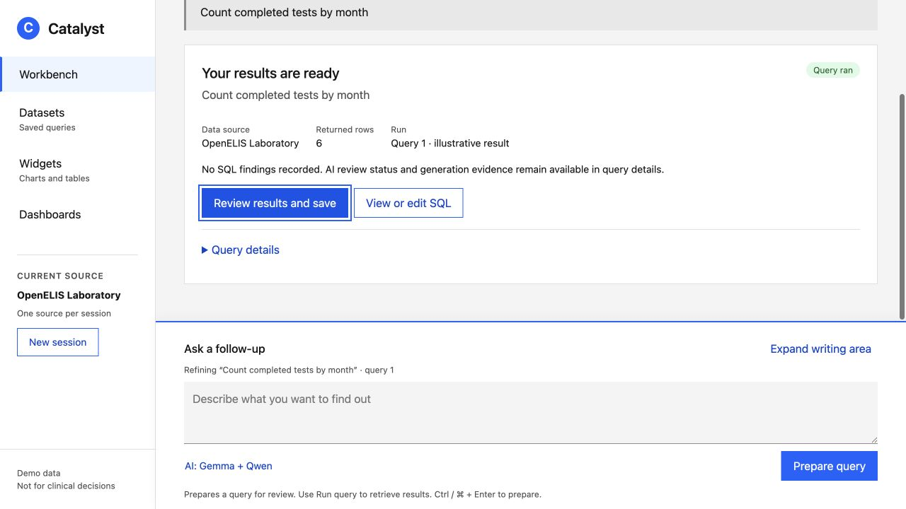

# Research and QA record

Reviewed 9 September 2026. This is a design proposal and expert review, not a
usability study with clinical staff and not implementation acceptance.

## Evidence boundaries

The [overlap table](overlap.md) separates existing requirements, implementation
evidence, and proposed changes. It includes pinned Catalyst and harness sources.

- **Live app observations:** earlier in this review, existing OpenELIS and
  OpenMRS HIV verification sessions were inspected in the local Catalyst app at
  revision `c0e11c733927331d9380256f60188416ed41edf8`, at 1280 × 720. No model request,
  database execution, Dataset save, or publication was made for that inspection.
- **Current source comparison:** this PR starts from Catalyst `main` at
  `4c6a46fa121ea7ce6dff7784547e2eb6aa236fa6`. Relevant UI code was rechecked for the
  overlap table. Source inspection does not prove that revision is deployed.
- **Mock checks below:** run against this directory's fictional, in-memory
  preview. Source selection, query preparation, saves, and publication buttons
  only change illustrative state. They make no application-service requests.

## Observed product friction

Both sources had a fixed 72 px follow-up field with resizing disabled. An
eight-line question needed 216 px of content height. Initial and follow-up
questions use different component implementations. The landing screen displayed
30 technical OpenELIS relation cards; the design already calls for a compact
complete-data browser. OpenMRS exposed `configured_limit` without explaining that
more rows existed and the total was unknown. Dataset review placed internal
metadata above results. Escape closed that panel but returned focus to BODY in
two observations, despite existing focus-restoration code.

The analyst editor and empty libraries were inspected. Populated Widget
arrangement, live publication/import, mobile behavior and all conversation
outcomes were **not** validated in that live-app review. The earlier viewport
override retained 1280 × 720; narrow mock checks below are a separate result.

## Research applied

Sources were checked on 9 September 2026. The proposal combines current component
guidance with established usability principles; it does not require a new
framework or claim that longstanding guidance is newly invented.

| Source | Finding used in the design |
| --- | --- |
| [Carbon: Text input and TextArea](https://carbondesignsystem.com/components/text-input/usage/) | Longer input needs a persistent label and adequate space; use the existing TextArea with vertical resizing. |
| [Nielsen Norman Group: Progressive disclosure](https://www.nngroup.com/articles/progressive-disclosure/) | Put frequent tasks first and keep secondary controls discoverable. Apply to SQL, schema, model configuration and traces without hiding errors or removing access. |
| [Carbon for AI](https://carbondesignsystem.com/guidelines/carbon-for-ai/) and [AI label](https://carbondesignsystem.com/components/ai-label/usage/) | Identify AI-prepared content in context and expose its actual details. Do not label a person's input as AI-generated. |
| [Nielsen Norman Group: Explainable AI in Chat Interfaces](https://www.nngroup.com/articles/explainable-ai/) (12 December 2025) | Plausible explanations can encourage misplaced trust. Use recorded outcomes and limitations, without invented confidence or reassuring model rationales. |
| [Carbon: Notifications](https://carbondesignsystem.com/components/notification/usage/) | Explain what happened and the next useful action. Keep actionable errors visible; use brief confirmations for successful saves. |
| [GOV.UK: Error messages](https://design-system.service.gov.uk/components/error-message/) | State the problem and recovery action in understandable language; retain the original diagnostic separately. |
| [W3C: Dragging movements](https://www.w3.org/WAI/WCAG22/Understanding/dragging-movements.html) | Custom dragging needs an equivalent non-drag pointer action, not keyboard support alone. Native browser controls have an exception. Expand/Restore makes resizing more accessible regardless. |
| [W3C: Target size](https://www.w3.org/WAI/WCAG22/Understanding/target-size-minimum.html) | Respect the 24 CSS-pixel minimum or applicable spacing exceptions; the mock's action buttons use larger targets. |
| [W3C: Focus not obscured](https://www.w3.org/WAI/WCAG22/Understanding/focus-not-obscured-minimum.html) | Fixed content must not conceal focused controls. Reserve real layout space for the composer and check focused result actions. |

## Mock checks actually performed

Served this directory with Python's standard HTTP server; no build, dependency
installation, model calls, database access or credentials were needed.

| Check | Observed result |
| --- | --- |
| Native vertical resize, direct desktop mock at 1280 × 720 | Eight-line draft resized from 88 to 138 px. Expand reached 288 px; Restore returned to 138 px. All eight lines survived each action. |
| Expand/Restore in preview frame | Eight-line draft expanded from 88 to 248 px and restored to 88 px at the initially measured 620 px frame height; draft retained. |
| Actual 320, 390, 640 and 1280 CSS-pixel frame widths | Root width equaled scroll width at every size: no page-level horizontal overflow. After removing the preview border, frame height was 622 px. The narrow navigation scrolls within its own row. |
| Expanded input at all four widths | Prepare remained within the frame (button bottoms approximately 598, 564, 582 and 582 px respectively). Review results could be opened at every width; main content scrolls independently above the composer. |
| Panel keyboard handling | Shift+Tab from first control wrapped to last; Tab from last wrapped to first. Escape returned focus to the actual Review results and save trigger. |
| Explicit preparation | Ctrl+Enter changed the fixture to Query ready for review with a separate Run action. This exercised no AI or SQL. |
| Source and model choice | Starting an OpenMRS session changed the visible source. Selecting the writer-only fixture profile changed the compact AI label. |
| Save and reuse fixture | Edited Dataset and Widget names appeared in their libraries; selected Table presentation was retained in the Widget description. Add to dashboard and Publish reached Waiting for import. Nothing was persisted or published outside this page. |
| Failure and limitation fixtures | Inspected Limited results, Database error, Clarification, Unable to answer, Imported and Import failed. Open dashboard appears in the imported fixture; a failed import does not expose it. |
| JavaScript syntax | `node --check docs/specs/staff-workbench-ux/mock.js` passed. |
| Artifact integrity | Local Markdown/HTML references and HTML ID uniqueness checked; `git diff --check` passed. |

QA found two mock defects and they were corrected before this record: the
enlarged composer covered a result button, and native dialog focus could leave
the preview iframe. The final mock uses CSS grid to allocate content/composer
space, caps narrow-screen input growth, and wraps focus at panel boundaries.
Browser automation also produced intermittent selector timeouts; direct-page
resize checks and the completed width/focus checks above are the observations
used here, not an assertion of a clean automation-console log.

The screenshot and preview use fictional data. They do not depict an actual
clinical result or a newly deployed application.

## Remaining implementation verification

No production code changed, so the application test suites were not run. This
mock is intentionally not an alternative implementation of Catalyst. It does
not demonstrate durable history, model/SQL correctness, complete catalog
pagination, query parameters, empty/stale result logic, asynchronous failure
recovery, multi-widget arrangement, bundle bytes or real importer receipts.

Production work must apply the [spec's acceptance checks](spec.md#acceptance-and-sequencing)
to the shared Carbon components and actual application states. Short viewports,
zoom, screen readers, dark/system theme, representative clinical/program staff
and analyst task sessions remain unverified. Final Dashboard acceptance still
requires the existing owner review with the real integrated stack.
